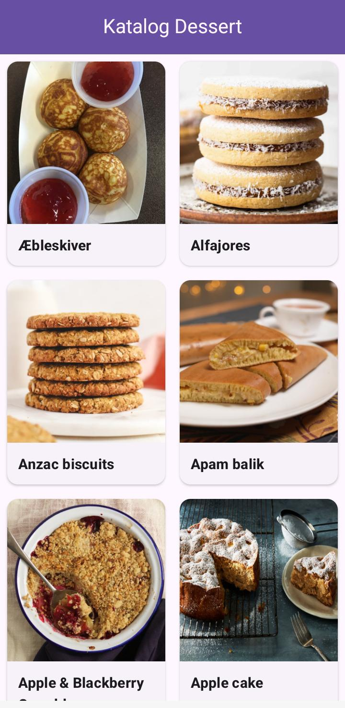
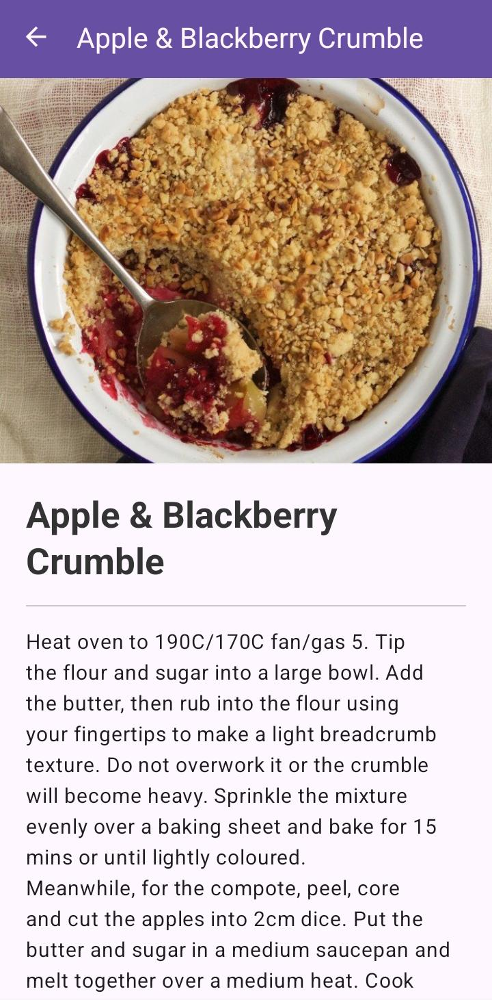

# Praktikum P12-13 - Network API

## Identitas
- Nama: Syifa Azziza Amelia Shahab
- NIM: 2410501038
- Kelas: B

---

## Deskripsi Aplikasi
Aplikasi Android ini menampilkan daftar makanan dari API TheMealDB menggunakan:
- Volley untuk request API
- RecyclerView untuk list data
- Glide untuk load gambar
- ViewBinding untuk akses layout

---

## Screenshot Aplikasi

### Home

### Detail

---

## Teknologi
- Java
- Android Studio
- Volley
- Glide
- Material Design